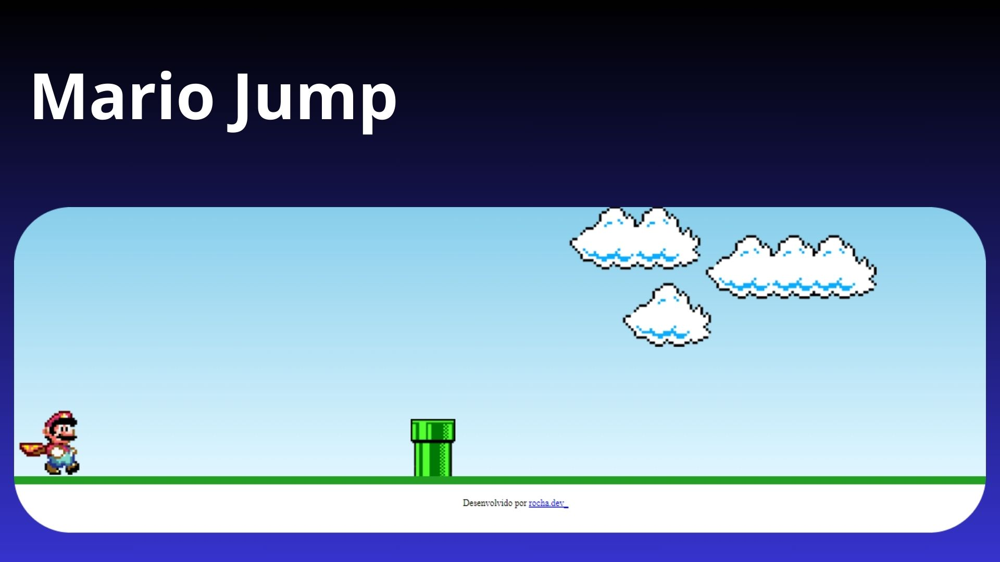

<h1 align="center"> Mario Jump </h1>

Projeto pessoal desenvolvido para praticar.  

  <a href="#-tecnologias">Tecnologias</a>&nbsp;&nbsp;&nbsp;|&nbsp;&nbsp;&nbsp;
  <a href="#-projeto">Projeto</a>&nbsp;&nbsp;&nbsp;|&nbsp;&nbsp;&nbsp;
  <a href="#memo-licença">Licença</a>

  

 

  

## 🚀 Tecnologias

Esse projeto foi desenvolvido com as seguintes tecnologias:

- HTML e CSS
- JavaScript
- Git e Github

## 💻 Projeto

O objetivo do projeto "Mario Jump" é praticar e aprimorar habilidades de desenvolvimento web incluindo HTML para estruturação do conteúdo, CSS para estilização visual e JavaScript para interatividade e lógica de jogo. Além disso, o projeto visa proporcionar uma oportunidade de explorar conceitos de design de jogos simples e aprender a aplicá-los em um ambiente web.

## :memo: Licença